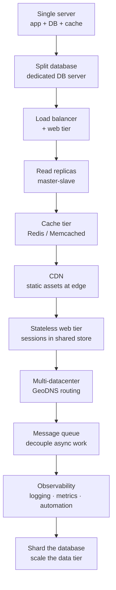
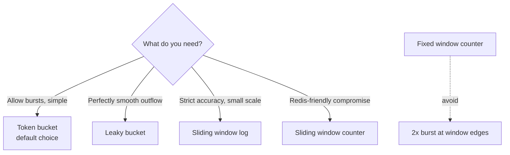
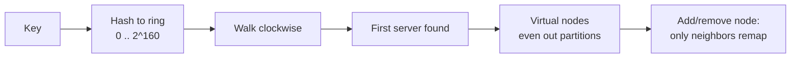
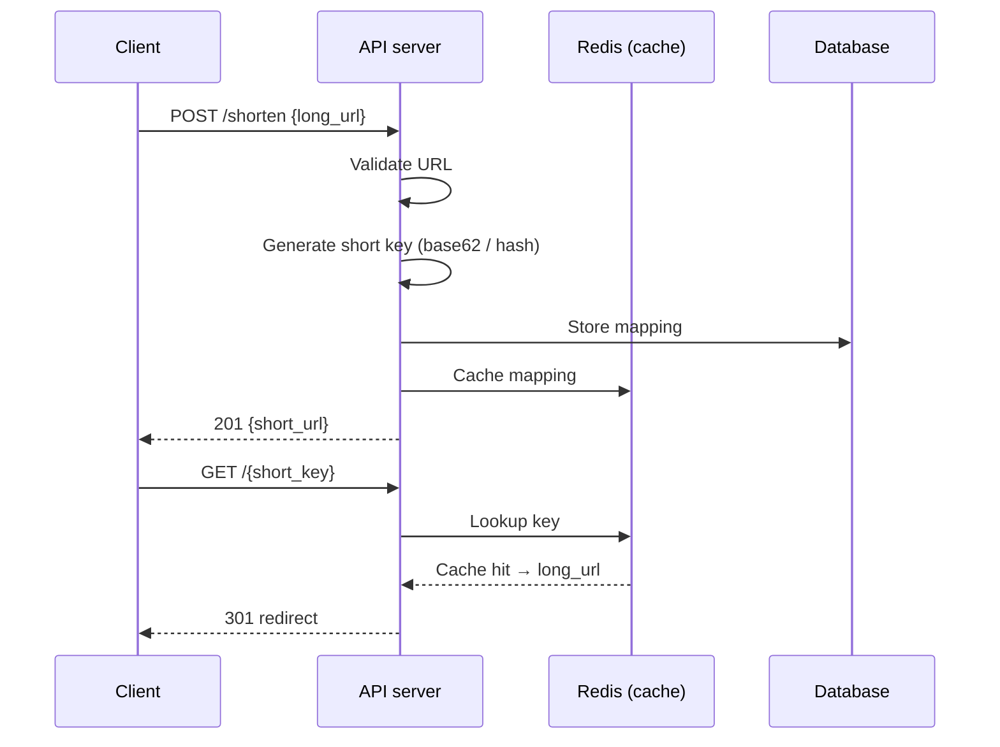

# System Design Reference

**28 system designs distilled from Alex Xu's *System Design Interview — An Insider's Guide* (Vol 1 & Vol 2)**

A practical, interview-ready reference covering the 4-step design framework, back-of-the-envelope estimation, and 28 real-world architectures — from rate limiters to stock exchanges.

**Developed by [Yaseen Ahmad](https://github.com/MrYaseen0)** — Full-Stack Developer

---

## 📖 What's inside

| # | Area | Chapters |
|---|------|----------|
| 1–3 | **Foundations** | Scale from zero to millions · Back-of-the-envelope estimation · The 4-step interview framework |
| 4–8 | **Building blocks** | Rate limiter · Consistent hashing · Key-value store · Unique ID generator · URL shortener |
| 9–15 | **Vol 1 systems** | Web crawler · Notification system · News feed · Chat system · Search autocomplete · YouTube · Google Drive |
| 16–28 | **Vol 2 systems** | Proximity service · Nearby friends · Google Maps · Distributed message queue · Metrics monitoring · Ad click aggregation · Hotel reservation · Distributed email · S3-like object storage · Real-time gaming leaderboard · Payment system · Digital wallet · Stock exchange |

Every chapter covers: problem statement → scale targets → API sketch → high-level components → data model → key algorithms & trade-offs → deep-dive discussion points.

The full reference lives in [`SYSTEM_DESIGN_REFERENCE.md`](./SYSTEM_DESIGN_REFERENCE.md) — one dense, searchable document. A printable PDF handbook is included as [`System-Design-Reference.pdf`](./System-Design-Reference.pdf).

---

## 🏗️ Architecture diagrams

### The scaling ladder — from one server to millions of users

### Choosing a rate-limiting algorithm

### Consistent hashing — only K/n keys move

### URL shortener — write path

---

## 🎯 Best use cases

| You're building... | Read these chapters |
|---|---|
| A public API that needs abuse protection | 4 — Rate limiter |
| A distributed cache or storage layer | 5, 6 — Consistent hashing, Key-value store |
| Short links for marketing / sharing | 8 — URL shortener |
| A search engine or content indexer | 9 — Web crawler |
| Push / email / SMS notifications | 10 — Notification system |
| A social feed (Twitter/X clone) | 11 — News feed (fanout-on-write vs read) |
| Real-time messaging (WhatsApp clone) | 12 — Chat system (WebSocket, presence) |
| Instant search suggestions | 13 — Search autocomplete (trie) |
| Video upload & streaming platform | 14 — YouTube |
| Cloud file storage (Drive/Dropbox clone) | 15 — Google Drive |
| "Near me" / delivery / ride-hailing features | 16–18 — Proximity, Nearby friends, Google Maps |
| Async workers, event-driven pipelines | 19 — Distributed message queue |
| Dashboards, alerting, SRE tooling | 20 — Metrics monitoring |
| Billing, wallets, fintech | 26–28 — Payment system, Digital wallet, Stock exchange |
| Prepping for FAANG-style interviews | 3 (framework) → 2 (estimation) → any system |

---

## 🧮 Estimation cheat sheet

| Fact | Value |
|---|---|
| 2.5M requests/day | ≈ 30 QPS |
| L1 cache → RAM → SSD → disk seek | 0.5ns → 100ns → 150µs → 10ms |
| Cross-region round trip | ~100ms |
| Rule of thumb | Round aggressively, write assumptions down, double for peak |

Full worked examples (Twitter: 3.5k QPS / 55PB; crawler: 400 pages/s / 30PB; email: 100k/s) are in the reference doc.

---

## 🛠️ How to use this for your projects

1. **Start with Chapter 3** — the 4-step framework (clarify scope → high-level design → deep dive → wrap-up).
2. **Estimate first** — Chapter 2 gives you the numbers to justify every component choice.
3. **Pick your pattern** — the patterns index in the reference maps each technique (consistent hashing, sharding, CQRS, fanout, geohash, idempotency…) to the chapters that use it.
4. **Steal the data models** — each chapter includes a concrete schema you can adapt to Postgres/MongoDB/Redis.

## 📚 Sources & attribution

Synthesized from the open notes at [liquidslr/system-design-notes](https://github.com/liquidslr/system-design-notes), which summarize Alex Xu's *System Design Interview — An Insider's Guide* Vol 1 & 2. If this reference helps you, consider buying the books — they're worth it.

## 📄 License

MIT — free to use, share, and adapt. See [LICENSE](./LICENSE).
